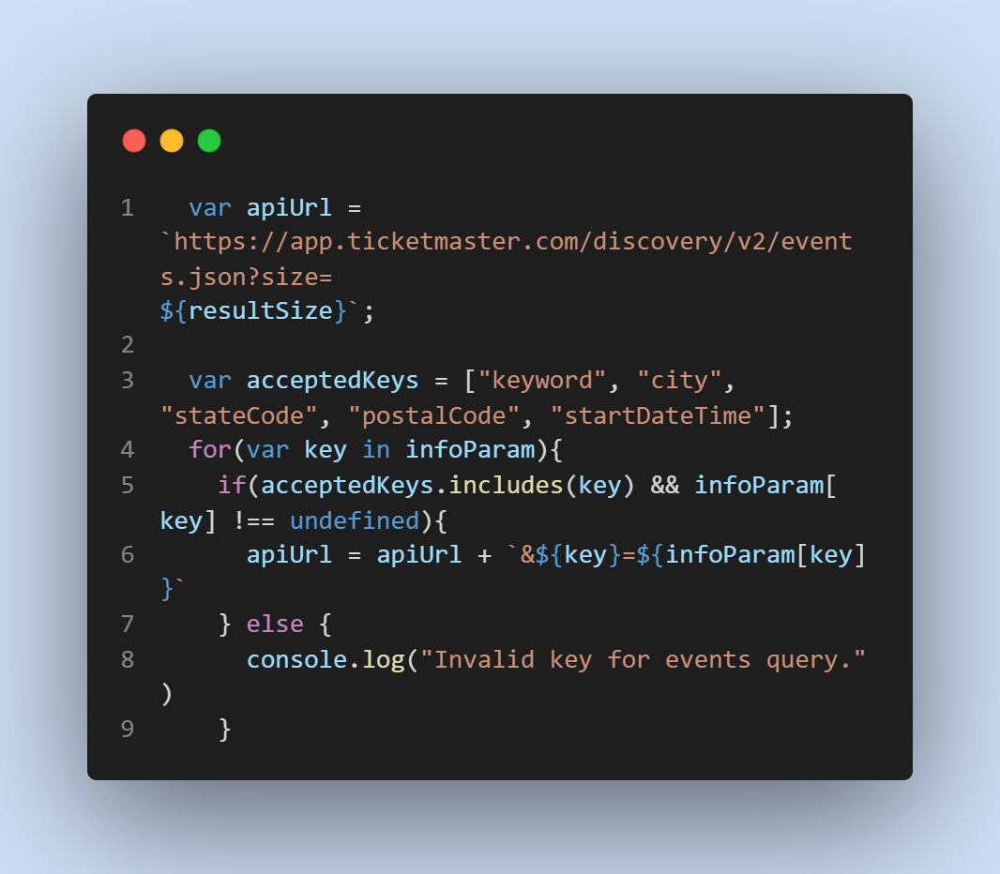
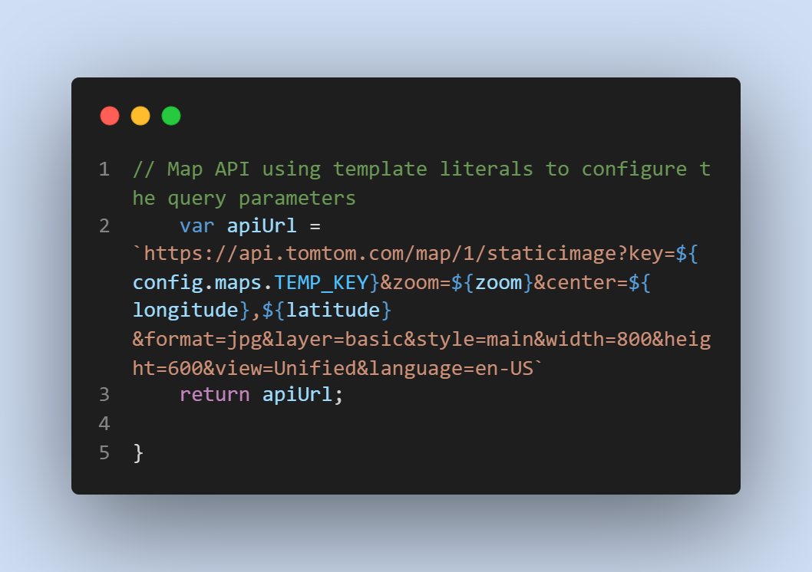
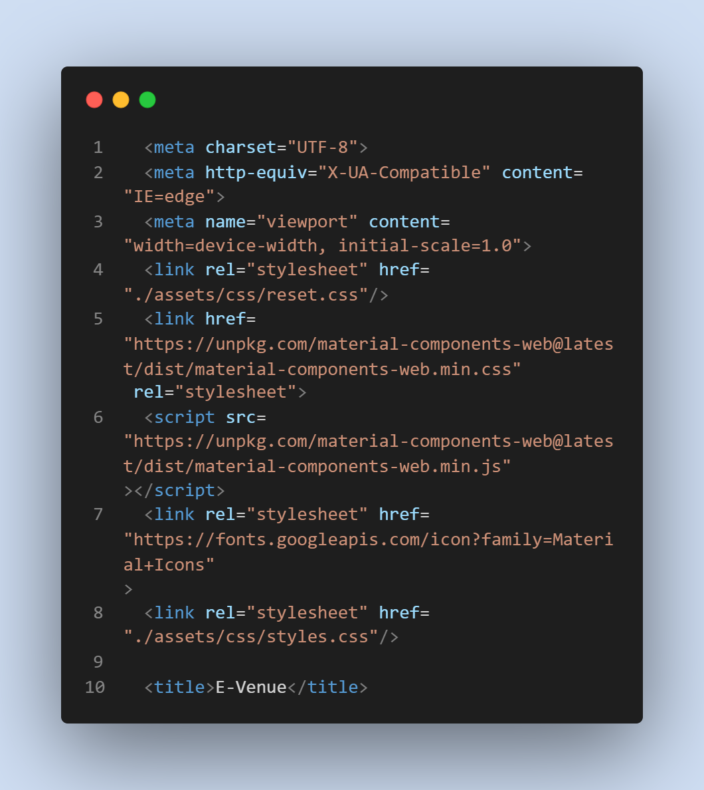
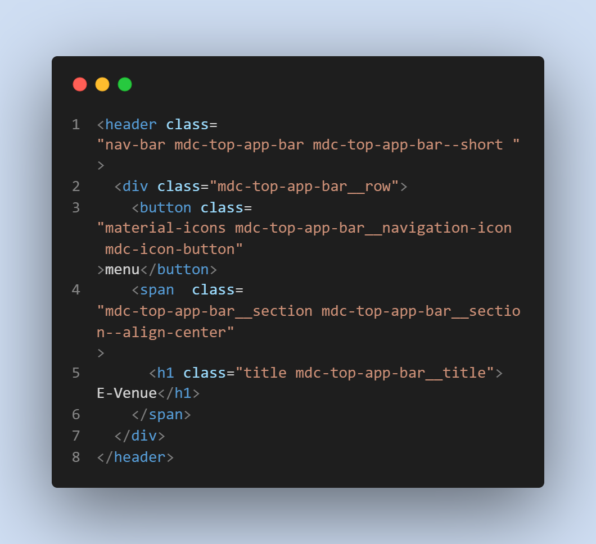

# E-Venue

## A page to help find events happening nearby.
[Click here to the deployed page.](https://jesus1881.github.io/E-Venue/)

 

# Table of contents
1. [Technologies used](#tech-used)
2. [Features](#features)
3. [Screenshots](#screenshots)
4. [Contributors](#contributors)
5. [License](#license)

## Technologies used
* Html
* Css
* Javascript
* Material.io
* Ticketmaster Api 
* TomTom Api

## Features
* Search by location
* Image of artist/venue will render on search
* Additional info including date, time, price, and a description
* Map of event location also populate
* Recent searches are saved 

## Screenshots 
* API key for ticketmaster parameters and if key to find accepted keys for a specific area.

 

* Maps API key using template literals to configure the parameters.

 

* HTML reference tags for different sources.

 

* HTML Material style utilized in the Navigation Bar

 

## Contributors
* Eric Ng
* Travis Nichols
* Jesus Mendoza
* Araceli Gonzales

## License

Copyright 2022 Travis Nichols, Jesus Mendoza, Eric Ng, and Araceli Gonzales

Permission is hereby granted, free of charge, to any person obtaining a copy of this software and associated documentation files (the "Software"), to deal in the Software without restriction, including without limitation the rights to use, copy, modify, merge, publish, distribute, sublicense, and/or sell copies of the Software, and to permit persons to whom the Software is furnished to do so, subject to the following conditions:

The above copyright notice and this permission notice shall be included in all copies or substantial portions of the Software.

THE SOFTWARE IS PROVIDED "AS IS", WITHOUT WARRANTY OF ANY KIND, EXPRESS OR IMPLIED, INCLUDING BUT NOT LIMITED TO THE WARRANTIES OF MERCHANTABILITY, FITNESS FOR A PARTICULAR PURPOSE AND NONINFRINGEMENT. IN NO EVENT SHALL THE AUTHORS OR COPYRIGHT HOLDERS BE LIABLE FOR ANY CLAIM, DAMAGES OR OTHER LIABILITY, WHETHER IN AN ACTION OF CONTRACT, TORT OR OTHERWISE, ARISING FROM, OUT OF OR IN CONNECTION WITH THE SOFTWARE OR THE USE OR OTHER DEALINGS IN THE SOFTWARE.